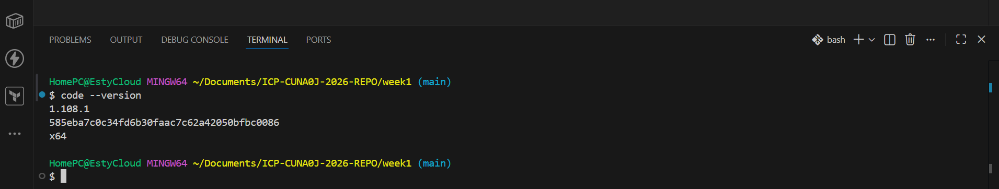
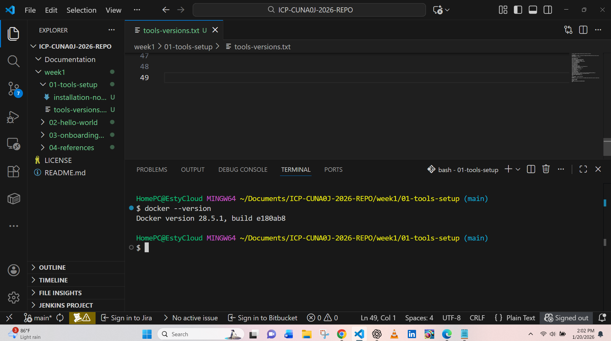

# Week 1 – Foundation & Setup (Technical Summary)
This document summarizes all tasks, setups, and proofs completed during `Week 1` of my DevOps Internship Program at InternCareerPath.

## Objective
Set up the development environment and validate it by running a basic Hello World proof of concept.

## Scope
- Environment setup
- Tool installed and verified
- Hello World proof of concept
- Onboarding summary
- References to official documentation

---

# Environment Setup
system and tools used for Week 1 

## Operating System
- OS: Windows 11

## Terminal - Bash
- Bash: I used bash to run commands, executing scripts, and manage files.

## Development Tools
- Editor: I used Visual Studio Code.

## Validation
I verified each setup by checking tool versions and successfully running a Hello World Bash script, confirming the environment is ready for further DevOps tasks.

# Tools Installed & Verified

## Git & GitHub
- Purpose: Version control
- Verification: `git --version`
- Git 2.42.0
OS: Windows 11

## Terminal - Bash CLI
- Purpose: Command-line operations
- Verification: `uname -a`
- Terminal: 10.0-22621

## VS Code
- Purpose: Code editor
- Verification: `code --version`
- VS code: 1.108.1

## Docker
- Purpose: Containerization
- Verification: `docker --version`
- Docker 24.0.2

## Azure CLI
- Purpose: Cloud interaction
- Verification: `az version`
- Azure-cli: 2.78.0 
Verification was done using version checks and basic commands.

# Hello World Proof of Concept
**Objective:** Confirm environment setup and tool functionality  

**Script file:** `week1/02-hello-world/hello-world.sh`  
**Output:** Stored in `hello-world-output.txt` with screenshot evidence in `screenshot.png`

## Implementation
A Bash script was created to print a simple message - hello world. This demonstrates that the environment is functional and scripts can be executed successfully.

# Onboarding summary
Week 1 included orientation and initial guidance on repository organization, submission standards, and documentation practices.  
**Key takeaway:** building a strong foundation and documenting every step is essential for DevOps workflows.

## References
**official documentation:**

- Git: https://git-scm.com/docs
- Docker: https://docs.docker.com
- Azure CLI: https://learn.microsoft.com/cli/azure
- Bash Scripting: https://www.gnu.org/software/bash/manual/

**Supplementary Tool**

# ChatGPT (OpenAI) 
  ChatGPT (OpenAI) – used for clarification, documentation structure guidance, and best-practice explanations

## Evidence Summary
- Tools installed and verified successfully  
- Hello World script executed with expected output  
- Screenshots and text outputs saved in `week-1/02-hello-world/`  
- Documentation organized for clear traceability and future reference

